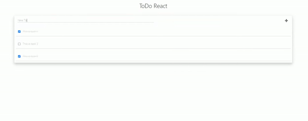

# Simple ToDo (Learning React)

This mini project is part of [Learn React for free](https://scrimba.com/playlist/p7P5Hd) on [Scrimba](https://scrimba.com/)

The goal is to understand basic concepts in react and build a simple ToDo app.

## Available Scripts

In the project directory, you can run:

### `npm start`

Runs the app in the development mode. 
Open [http://localhost:3000](http://localhost:3000) to view it in the browser.

The page will reload if you make edits. 
You will also see any lint errors in the console.
